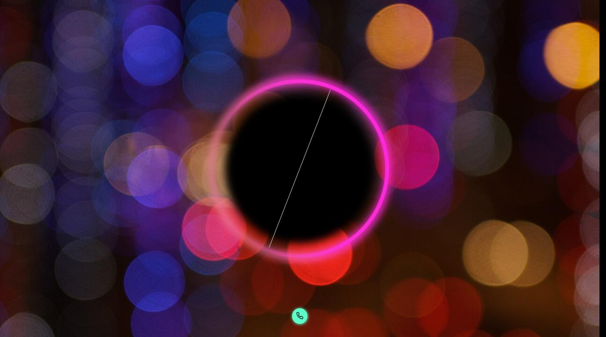
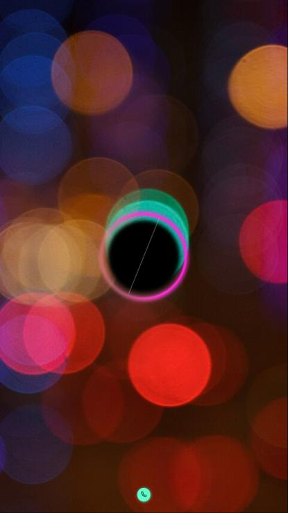
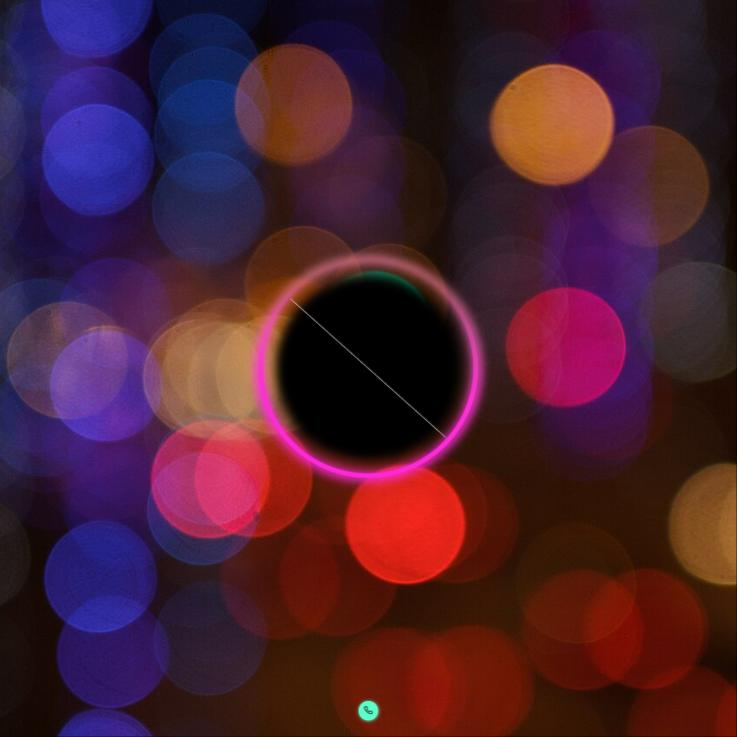

# DSPLAY - Voice AI Template

A [React](https://reactjs.org/) [HTML-based template](https://developers.dsplay.tv/docs/html-templates) for the [DSPLAY - Digital Signage](https://dsplay.tv/) platform — connects to a [Vapi](https://vapi.ai/) voice assistant and shows a full-screen animated visualizer synced to the microphone and to the assistant's call.

> Built with [Vite](https://vitejs.dev/), requires Node.js 22.22.2+, 24.15.0+, or 26+ (see `.nvmrc`).

## Supported screen formats

| Landscape | Portrait | Square |
|-----------|----------|--------|
|  |  |  |

> Horizontal and vertical banner formats are omitted: the decorative ring (`.spinner`) rotates a full 360° every 10s via a CSS animation, and its SVG box is sized to 80% of the container's width/height — for a 1920×200 or 200×1920 canvas that box is a 1536×160 (or 160×1536) rectangle. Rotated, its axis-aligned bounding box swings far outside the short dimension for all but a sliver of each cycle (confirmed via `getBoundingClientRect()`: at one sampled angle the ring's box spanned x≈-635 to x≈835 inside a 200px-wide viewport, over 3x the visible width); trigonometrically only the ~3% of the rotation nearest 0°/90°/180°/270° stays contained. Landscape/portrait/square keep the same rotation but their SVG box is closer to square (or exactly square, for square), so the worst-case overflow stays modest and mostly off-canvas-background rather than clipping the visualizer itself.

## Features

- Requests microphone permission, runs a short audio-level test, then loads the [Vapi](https://vapi.ai/) widget and starts the assistant.
- Full-screen SVG visualizer reacting to the microphone input, using a configurable two-color gradient.

## Template variables

| Key                    | Type   | Description                                                                                     |
|------------------------|--------|---------------------------------------------------------------------------------------------------|
| `assistant_id`         | string | The Vapi assistant ID to connect to.                                                             |
| `api_key`              | string | The Vapi API key used to authenticate the widget.                                                |
| `gradiente_color_1`    | string | Primary color of the visualizer's gradient.                                                      |
| `gradiente_color_2`    | string | Secondary color of the visualizer's gradient.                                                    |
| `background_media`     | string | Background image shown behind the visualizer. Falls back to `background_image_url` when unset.  |
| `background_image_url` | string | Alternate background image URL, used only when `background_media` is unset.                     |

> Remember to also register these as Template Vars (same name and type) when configuring this template in the DSPLAY CMS.

## Local development

```sh
npm install
npm start
```

`public/dsplay-data.js` defines `dsplay_config`/`dsplay_media`/`dsplay_template` mock globals used only when the template isn't running inside the actual DSPLAY app. Edit it to try out different values — the DSPLAY Player App replaces it with real content at runtime.

Browser microphone access requires a secure context — `npm start` serves over `http://localhost`, which browsers treat as secure for this purpose, so no extra setup is needed locally.

## Packing (release build)

```sh
npm run zip
```

This builds the template with Vite, which also generates `template-variables.json` + `template-example-data.json` (via [@dsplay/template-manifest](https://www.npmjs.com/package/@dsplay/template-manifest)'s Vite plugin) — the DSPLAY CMS reads these two files to auto-detect this template's variables and seed default preview values. It then generates `template.zip`, ready to be deployed to the [DSPLAY Web Manager](https://manager.dsplay.tv/template/create).

## Test assets

To use test assets (images, videos, etc) during development, put them in the `public/test-assets` folder and reference them in `dsplay-data.js` using their relative path. `public/test-assets` is automatically excluded from the release build.

## Maintaining dependencies

Regular npm dependencies, not vendored files:

```sh
npm outdated
npm update
```

For a version outside the declared range (typically a major bump), apply it deliberately and verify `npm start`, `npm run build`, and `npm test` still work before committing.

### Commit conventions

See [AGENTS.md](AGENTS.md).

## More

To see more about DSPLAY HTML Templates, visit: https://developers.dsplay.tv/docs/html-templates
